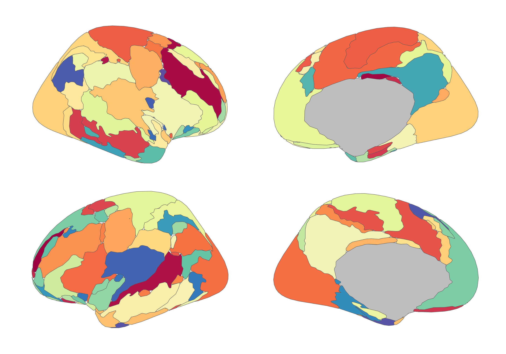

<!-- README.md is generated from README.qmd. Please edit that file -->

# ggsegPower 

<!-- badges: start -->

[](https://github.com/ggseg/ggsegPower/actions)
[](https://zenodo.org/badge/latestdoi/417497619)
<!-- badges: end -->

This package contains dataset for plotting the Power atlas for ggseg.

Power, J. D., Cohen, A. L., Nelson, S. M., Wig, G. S., Barnes, K. A.,
Church, J. A., … & Petersen, S. E. (2011). Functional network
organization of the human brain. Neuron, 72(4), 665-678.
[PubMed](https://www.ncbi.nlm.nih.gov/pmc/articles/PMC3222858/)

To learn how to use these atlases, please look at the documentation for
[ggseg](https://ggseg.github.io/ggseg/)

## Installation

We recommend installing the ggseg-atlases through the ggseg
[r-universe](https://ggseg.r-universe.dev/ui#builds):

``` r
options(repos = c(
  ggseg = "https://ggseg.r-universe.dev",
  CRAN = "https://cloud.r-project.org"
))

install.packages("ggsegPower")
```

You can install from [GitHub](https://github.com/) with:

``` r
# install.packages("remotes")
remotes::install_github("ggseg/ggsegPower")
```

## Example

``` r
library(ggsegPower)
#> 
#> Attaching package: 'ggsegPower'
#> The following object is masked from 'package:stats':
#> 
#>     power
library(ggseg)
library(ggplot2)

ggplot() +
  geom_brain(
    atlas = power(),
    mapping = aes(fill = label),
    position = position_brain(hemi ~ view),
    show.legend = FALSE
  ) +
  scale_fill_manual(values = power()$palette, na.value = "grey") +
  theme_void()
```



Please note that the ‘ggsegPower’ project is released with a
[Contributor Code of Conduct](CODE_OF_CONDUCT.md). By contributing to
this project, you agree to abide by its terms.
