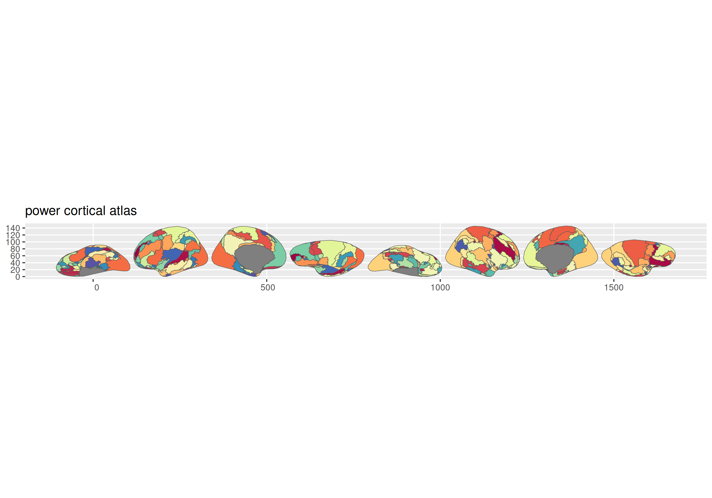

<!-- README.md is generated from README.qmd. Please edit that file -->

# ggsegPower 

<!-- badges: start -->

[](https://github.com/ggsegverse/ggsegPower/actions/workflows/R-CMD-check.yaml)
[](https://ggseg.r-universe.dev/ggsegPower)
<!-- badges: end -->

This package contains dataset for plotting the Power atlas for ggseg.

Power JD, Cohen AL, Nelson SM, Wig GS, Barnes KA, Church JA, … &
Petersen SE (2011). Functional network organization of the human brain.
*Neuron*, 72(4), 665-678.
[PubMed](https://www.ncbi.nlm.nih.gov/pmc/articles/PMC3222858/)

## Installation

We recommend installing the ggseg-atlases through the ggseg
[r-universe](https://ggseg.r-universe.dev/ui#builds):

``` r
options(repos = c(
  ggseg = "https://ggseg.r-universe.dev",
  CRAN = "https://cloud.r-project.org"
))

install.packages("ggsegPower")
```

You can install this package from [GitHub](https://github.com/) with:

``` r
# install.packages("pak")
pak::pak("ggsegverse/ggsegPower")
```

## Power atlas

``` r
library(ggseg)
library(ggsegPower)
#> 
#> Attaching package: 'ggsegPower'
#> The following object is masked from 'package:stats':
#> 
#>     power
library(ggplot2)

ggplot() +
  geom_brain(
    atlas = power(),
    mapping = aes(fill = label),
    position = position_brain(hemi ~ view),
    show.legend = FALSE
  ) +
  theme_void()
```



## Data source

Power JD, Cohen AL, Nelson SM, Wig GS, Barnes KA, Church JA, … &
Petersen SE (2011). Functional network organization of the human brain.
*Neuron*, 72(4), 665-678.
